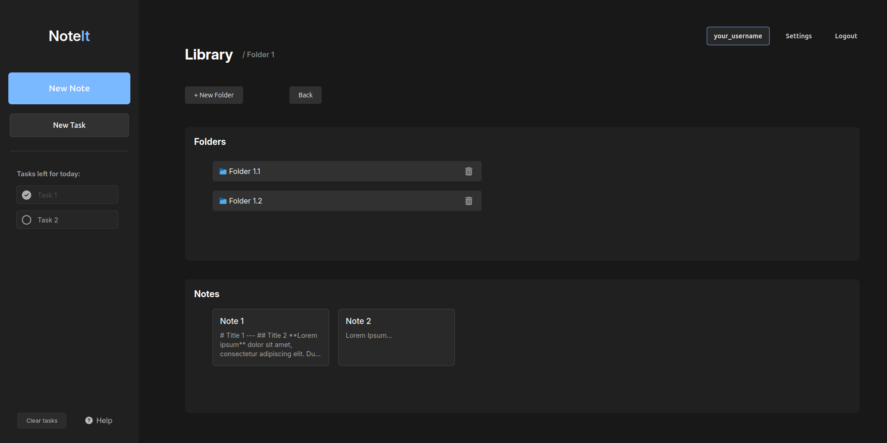
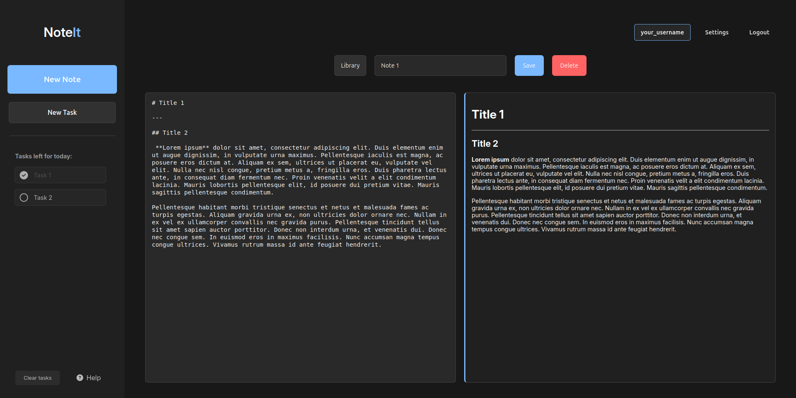

# NoteIt

## 1. Introduction

NoteIt is a modern, full-stack note-taking application that helps you organize your thoughts, tasks, and documents in a clean and intuitive interface. Built with React for the frontend and Flask for the backend, NoteIt provides a seamless experience for managing your digital notes using Markdown formatting. With full Markdown support, you can create beautifully formatted notes with headers, lists, code blocks, and more, while maintaining a simple and clean text-based format.





## 2. Features

### 📁 2.1 Folder Organization

-  Create and manage folders to organize your notes
-  Hierarchical folder structure with unlimited nesting
-  Easy navigation through folder paths

### 📝 2.2 Note Management

-  Create, edit, and delete notes
-  Rich text formatting with Markdown support
-  Real-time updates
-  Organize notes within folders
-  Built-in Markdown Help button with simple formatting instructions for beginners

### ✅ 2.3 Task Management

-  Create and track tasks

### 👤 2.4 User Features

-  Secure user authentication
-  Customizable user settings
-  Personal workspace for each user

## 3. Setup Instructions

### 3.1 Prerequisites

-  Python 3.x
-  Node.js and npm
-  MySQL database

### 3.2 Initial Setup

1. Clone the repository:

   ```bash
   git clone https://github.com/joaolscosta/NoteIt
   cd NoteIt
   ```

2. Create a `.env` file in the root directory with the following variables:

   ```
   DB_HOST=your_database_host
   DB_USER=your_database_user
   DB_PASSWORD=your_database_password
   DB_NAME=your_database_name
   ```

### 3.3 Running the Application

1. Create and activate the virtual environment for the backend:

   ```bash
   python -m venv venv
   source venv/bin/activate
   ```

2. Start the backend server:

   ```bash
   ./init-backend.sh
   ```

   This script will install dependencies and start the Flask server.

3. Start the frontend application:

   ```bash
   ./init-frontend.sh
   ```

   This script will install dependencies and start the React development server.

## 3.4 Technologies Used

-  **Frontend**: React.js
-  **Backend**: Flask (Python)
-  **Database**: MySQL
-  **Authentication**: BCrypt
-  **API**: RESTful architecture

## 4. License

This project is licensed under the MIT License - see the LICENSE file for details.
